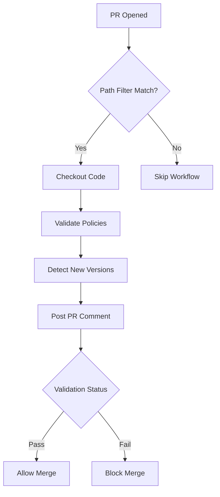
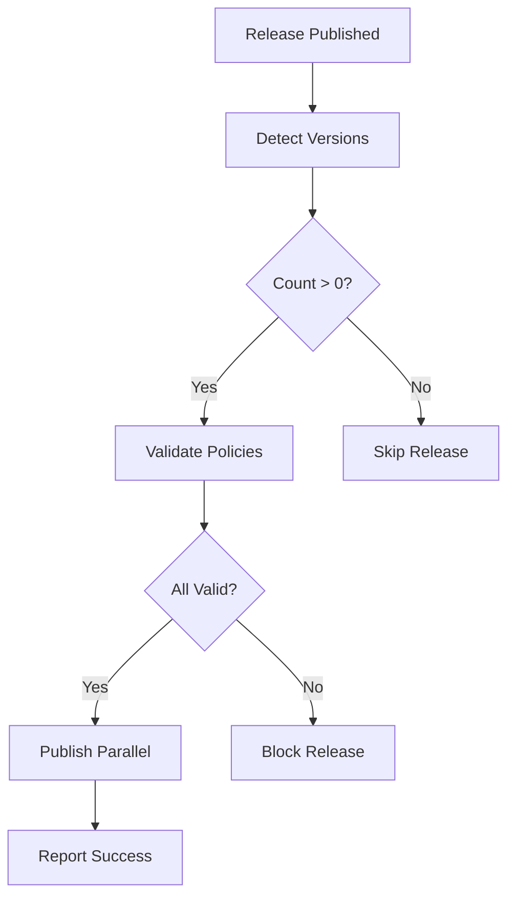

# 📋 Policy Contribution Flow - Proposed Solution

## Overview

This discussion outlines the comprehensive **Policy Contribution Flow** for the Policy Hub system, detailing how policies are contributed, validated, and published through an automated CI/CD pipeline.

## 🎯 Current Architecture

### Repository Structure
```
policy-hub/
├── policies/           # Policy definitions
│   └── {policy-name}/
│       └── v{version}/
│           ├── metadata.json
│           ├── policy-definition.yaml
│           ├── src/main.go
│           └── docs/
├── scripts/            # Validation & utility scripts
├── config/             # Configuration files
└── .github/            # CI/CD workflows & actions
```

## 🔄 Policy Contribution Flow

### Phase 1: Policy Development

**Contributor Actions:**
1. **Fork Repository** - Create fork for policy development
2. **Create Policy Structure** - Follow required directory layout:
   ```
   policies/{policy-name}/v{version}/
   ├── metadata.json          # Policy metadata
   ├── policy-definition.yaml # Policy rules
   ├── src/main.go           # Implementation
   └── docs/                  # Documentation
       ├── overview.md
       ├── configuration.md
       └── examples.md
   ```
3. **Implement Policy Logic** - Write Go code with proper error handling
4. **Add Documentation** - Complete all required documentation files
5. **Test Locally** - Use validation scripts:
   ```bash
   ./scripts/validate-policy.sh {policy-name} v{version}
   ```

### Phase 2: Pull Request Submission

**Automated Validation Triggers:**
- PR opened
- Path filters: `policies/**`

**Validation Steps:**
1. **Code Checkout** - Full git history for SHA comparison
2. **Policy Structure Validation**
   - Required files check (metadata.json, policy-definition.yaml)
   - Required directories check (src/, docs/)
   - Documentation completeness
   - Metadata field validation
   - Go compilation validation (optional)
3. **Version Detection** - Identify new policy versions added
4. **PR Comment** - Detailed validation results with next steps

### Phase 3: Pre-Release Validation

**Release Trigger:**
- GitHub Release published with tag (e.g., `v1.2.3`)
> **⚠️ USER INTERACTION REQUIRED**: To publish a policy, users need to create a tag and do a release

**Batch Release Workflow (`batch-release.yml`):**
```yaml
name: Batch Release
on:
  release:
    types: [published]
```

**Release Process:**
1. **Version Detection**
   - Compare current release SHA with previous release tag
   - Identify all new policy versions since last release
2. **Pre-Release Validation**
   - Run full validation on all new policies
   - Block release if any validation fails
3. **Parallel Publishing**
   - Matrix strategy for concurrent publishing
   - Publish to Artifact Storage and Policy Hub API
   - Support for multiple storage backends

## 🛠️ Validation Rules (Configurable)

### Current Configuration (`config/policy-hub-config.json`)
```json
{
  "validation": {
    "requiredFiles": ["metadata.json", "policy-definition.yaml"],
    "requiredDirs": ["src", "docs"],
    "requiredDocsFiles": ["overview.md", "configuration.md", "examples.md"],
    "requiredMetadataFields": ["name", "displayName", "provider", "categories", "description", "version"],
    "strictValidation": true
  },
  "processing": {
    "enableGoBuildValidation": true,
    "maxParallelJobs": 3
  }
}
```

### Validation Checks
- ✅ **File Structure** - All required files present
- ✅ **Directory Structure** - Proper folder organization
- ✅ **Metadata Validation** - Required fields with correct types
- ✅ **Documentation** - All docs files present and non-empty
- ✅ **Code Quality** - Go compilation successful
- ✅ **Version Format** - Semantic versioning (v{major}.{minor}.{patch})

## 📊 Workflow Architecture

### PR Validation Flow


### Release Flow



## 🤔 Discussion Points

### Validation Flows Discussion

#### 1. **Multi-Layer Validation Strategy**
The current system implements validation at three distinct layers:

**Local Validation (Phase 1):**
- Developer runs `./scripts/validate-policy.sh` locally
- Immediate feedback during development
- Prevents submission of obviously broken policies
- No CI/CD costs for basic validation

**PR Validation (Phase 2):**
- Automated validation on policy changes only
- Comprehensive structure and content validation
- Blocks merge of invalid policies
- Provides detailed feedback via PR comments

**Release Validation (Phase 3):**
- Final quality gate before publishing
- Validates all policies in batch
- Ensures consistency across all new policies
- Prevents publication of flawed policies

#### 2. **Validation Scope & Performance**
- **Selective Triggering**: PR validation only runs when `policies/**` files change
- **Incremental Validation**: Only validates changed/new policies, not entire codebase
- **Parallel Processing**: Release validation uses matrix strategy for concurrent validation
- **Early Exit**: Fails fast on critical errors (missing directories, invalid syntax)

#### 3. **Validation Configuration Trade-offs**
- **Strict vs. Permissive**: Current `strictValidation: true` ensures quality but may frustrate contributors
- **Required Fields**: Balance between mandatory fields and contributor flexibility
- **Go Build Validation**: Ensures code quality but adds build time
- **Documentation Requirements**: Improves usability but increases contribution barrier

#### 4. **Validation Reliability & Maintenance**
- **Configuration Management**: JSON-based rules allow easy updates without code changes
- **Version Compatibility**: Validation rules evolve with policy format changes
- **Error Reporting**: Detailed error messages help contributors fix issues
- **Audit Trail**: Validation results logged for debugging and compliance

#### 5. **Scalability Considerations**
- **Large Repositories**: Path filtering prevents unnecessary validation runs
- **Multiple Contributors**: Concurrent PR validations handled independently
- **Batch Processing**: Release validation scales with number of new policies
- **Resource Optimization**: Minimal resource usage for validation-only workflows

#### 6. **Error Recovery & Rollback Strategies**

**Current Release Failure Scenarios:**
- **Partial Policy Failures**: Some policies publish successfully, others fail
- **Storage Backend Failures**: S3 upload succeeds but Policy Hub API fails
- **Validation Failures**: Pre-release validation catches issues after tagging
- **Network/Infrastructure Issues**: Temporary failures during publishing process

**Proposed Error Recovery Mechanisms:**

**Atomic Release Strategy:**
```yaml
# All-or-nothing approach
publish-policies:
  strategy:
    fail-fast: true  # Stop on first failure
    matrix:
      max-parallel: 1  # Sequential publishing for consistency
```

**Retry & Circuit Breaker Pattern:**
```bash
# Configurable retry logic
retry_count=3
retry_delay=30s
circuit_breaker_threshold=5
```

**Rollback Options:**

1. **Automated Rollback**:
   - Revert Policy Hub API registrations
   - Remove published artifacts from storage
   - Update release status to "failed"
   - Notify maintainers of rollback completion

2. **Manual Recovery Workflow**:
   - Generate detailed failure report
   - Provide rollback scripts for manual execution
   - Mark failed policies for re-publishing
   - Allow selective retry of failed policies only

3. **Partial Success Handling**:
   - Continue with successful policies
   - Queue failed policies for retry
   - Generate mixed-status release report
   - Enable incremental completion

**Recovery Configuration:**
```json
{
  "recovery": {
    "strategy": "manual|automatic|hybrid",
    "rollbackOnPartialFailure": false,
    "retryFailedPolicies": true,
    "maxRetryAttempts": 3,
    "rollbackTimeoutMinutes": 30,
    "notifyOnFailure": ["maintainers", "contributors"]
  }
}
```

### Open Questions on Validation Flows

1. **Contributor Experience** - How can we improve the contribution process?
2. **Security Considerations** - Additional security validations needed?
3. **Error Recovery** - How can we implement error recovery if some release goes wrong? Half fail? Rollback options?
4. **Validation Performance** - Are validation times acceptable for large policy contributions?
5. **Configuration Flexibility** - Should validation rules be customizable per policy type?
6. **Failure Notification** - How should we notify stakeholders of partial/complete release failures?
7. **Recovery Testing** - How do we test rollback and recovery mechanisms?
8. **Validation Testing** - How do we ensure validation rules themselves are correct?

What are your thoughts on this proposed Policy Contribution Flow? Any suggestions for improvements?